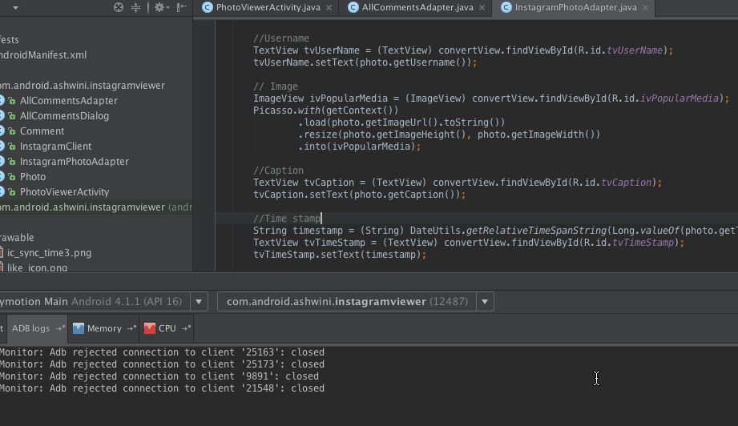

# Project : Instagram Viewer

#### Description : Build a read-only photo viewer for Instagram which allows a user to check out popular photos using [Instagram API](https://instagram.com/developer/endpoints/media/).
=================

Time spent: 9 hours spent in total

Completed user stories:

The following user stories must be completed:

 * [x] Required : User can scroll through current popular photos from Instagram which includes graphic, caption, username
 * [x] Optional : Relative timestamp, like count, user profile image
 * [x] Optional : Add pull-to-refresh for popular stream with SwipeRefreshLayout
 * [x] Optional : Show latest comment for each photo 
 * [x] Optional : Show last two comment for each photo 
 * [x] Optional : Display each photo with the same style and proportions as the real Instagram (see screens below)
 * [x] Optional : Display each user profile image using a RoundedImageView
 * [x] Optional : Improve the user interface through styling and coloring
 * [x] Optional : Allow user to view all comments for an image within a separate dialog fragment
 * [x] Optional : Display comment users profile pic and relative time since the comment was made. 
 
#### Demo 
----

GIF created with [LiceCap](http://www.cockos.com/licecap/).
